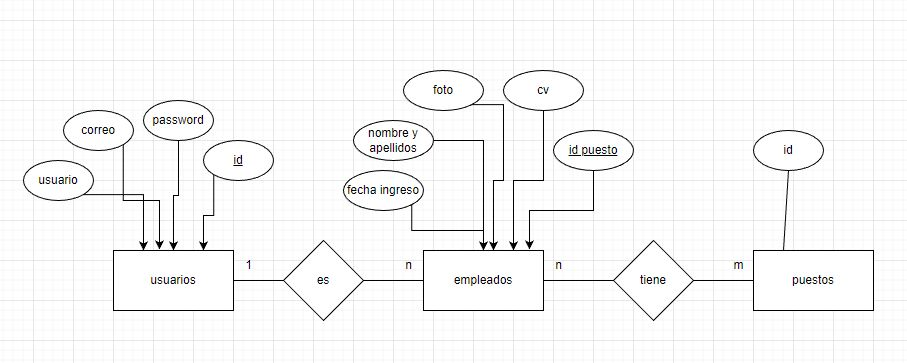
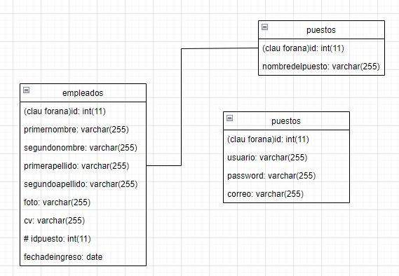

# Usuarios empresa(PHP & MySQL)
## ÍNDEX CONTENIDO
**IDE**: Visual Studio Code
**Lenguajes**: HTML, PHP

**Base de Datos**: MySQL

**Resumen**: Hemos desarrollado una pagina web donde podremos gestionar los trabajadores de una empresa

**Creadores**: Daniel Requena Lavado y Djordje  Minakovic

**DIAGRAMA ENTIDAD RELACIÓN**

**MODELO RELACIONAL**

- **Empleados** ( id,primernombre,segundonombre,primerapellido,segundoapellido,foto,cv,idpuesto,fechadeingreso ).
Donde id és llave forana de Empleados.
- **Usuarios** (id,usuario,password,correo).
Donde id és llave forana de Usuarios.
- **Puestos** ( id, nombredelpuesto).
Donde id és llave forana de Puestos.
